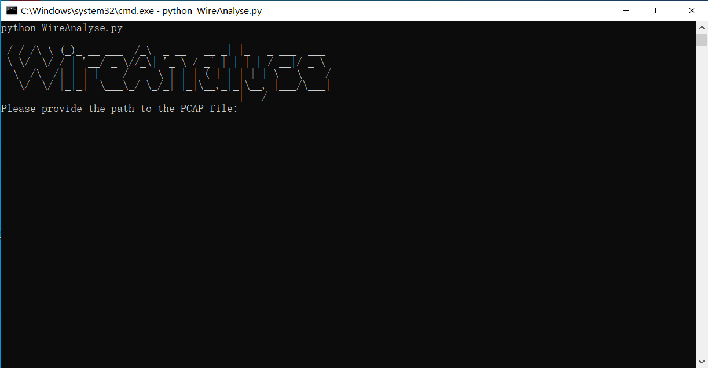

# WireAnalyse-WireShark数据包分析

## 一、工具介绍

WireAnalyse

## 二、安装

```python
git clone https://github.com/secsi1/WireAnalyse.git
pip3 install -r requirements.txt
```

## 三、使用方法

```
python WireAnalyse.py
```


现功能为：

1. 源IP
2. 目标IP
3. 主机名
4. 操作命令



